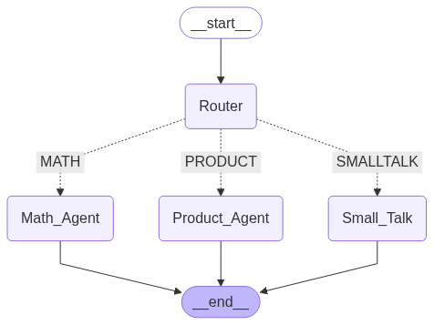

# Agentic Chatbot with LangGraph and LlamaIndex

This repository demonstrates how to build a powerful, modular chatbot that leverages the strengths of both **LangGraph** and **LlamaIndex** frameworks.

The solution is built on top of **LangGraph** for agent orchestration and workflow routing, and **LlamaIndex** for efficient document ingestion, indexing, and semantic retrieval from PDFs.

---

[**LangGraph**](https://langchain-ai.github.io/langgraph/) is a low-level orchestration framework designed for building, managing, and deploying long-running, stateful agents. It enables developers to define complex agent workflows as graphs, where each node represents a task or agent, and edges define the flow of information or control.

[**LlamaIndex**](https://docs.llamaindex.ai/en/stable/) is a flexible data framework for integrating private and public data with large language models (LLMs). It provides tools for data ingestion, indexing, and querying, making it ideal for building retrieval-augmented applications such as Q\&A bots over document corpora.


## System Architecture

| Component | Technology | Description |
| :-- | :-- | :-- |
| Routing Workflow | LangGraph | Directs user queries to the appropriate agent or tool based on intent. |
| RAG Engine | LlamaIndex | Retrieves and synthesizes answers from PDF-based knowledge base. |
| Chat Interface | Custom/LLM | Handles user interaction and maintains conversation state. |



## How It Works

### Routing Workflow Agent

- **Graph Construction:** The agent workflow is defined as a graph, where each node represents a specialized agent or tool (e.g., RAG, functions, or Agents).
- **Routing Logic:** When a user submits a query, the router node classifies the intent and directs the query to the appropriate agent.
- **Conditional Paths:** The workflow supports conditional branching, allowing for dynamic and context-aware routing.

**Example:**

- If the query is about document content, it is routed to the PDF Q\&A agent.
- If the query is greeting or good byes, it is handled by a default conversational agent.


### RAG with LlamaIndex

- **Document Ingestion:** PDF files are loaded and parsed into text chunks.
- **Indexing:** The text is indexed using vector embeddings for semantic search.
- **Query Processing:** When a routed query reaches the Q\&A agent, LlamaIndex retrieves relevant passages from the indexed PDFs and synthesizes an answer using the LLM.
- **Multi-Document Support:** The system can handle queries across multiple PDFs and combine information as needed.


### Integration: Bringing It All Together

- **Tool Abstraction:** LlamaIndex's query engine is exposed as a tool within the LangGraph workflow, allowing agents to invoke document retrieval as needed.
- **Stateful Orchestration:** LangGraph manages the flow of messages, state, and tool calls, ensuring a seamless user experience.
- **Extensibility:** New agents or tools can be added to the workflow graph with minimal changes, supporting future expansion.


## Setup \& Installation

1. **Clone the Repository:**

```bash
git clone https://github.com/yourusername/agentic-chatbot.git
cd agentic-chatbot
```

2. **Install Dependencies:**

```bash
pip install -r requirements.txt
# Ensure you have created a separate virtual environment for installing these packages
```

3. **Configuration:**

Create a `.env` file with necessary API keys and environment variables:

```bash
cp .env.example .env
```

## Customization

- **Add New Agents:** Define new nodes in the LangGraph workflow for additional capabilities.
- **Change Routing Logic:** Modify the router node to support new query types or more advanced classification.
- **Index More Data:** Use LlamaIndex to ingest and index other data sources (e.g., databases, web pages).