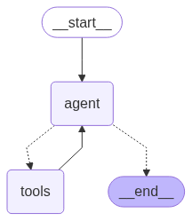

## Tools

Tools are a way to encapsulate a function and its input schema in a way that can be passed to a chat model that supports tool calling. This allows the model to request the execution of this function with specific inputs.

In this project we have made several agents which are handled by here own specilied agents.

